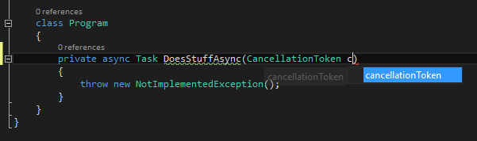

#
NamR

<!-- Update the VS Gallery link after you upload the VSIX--> Download this extension from the [VS Gallery](https://visualstudiogallery.msdn.microsoft.com/[GuidFromGallery])
or get the [CI build](http://vsixgallery.com/extension/A98A9358-9F24-4407-AAB7-5871243606AA/).

---------------------------------------

This extension will provide the IntelliSense completion for naming things in C#. That's right, no more typing cancellationToken in a paramter declaration.

See the [changelog](CHANGELOG.md) for changes and roadmap.

## Features

- IntelliSense for parameter names

### IntelliSense for parameter names

## Contribute
Check out the [contribution guidelines](CONTRIBUTING.md)
if you want to contribute to this project.

For cloning and building this project yourself, make sure
to install the
[Extensibility Tools 2015](https://visualstudiogallery.msdn.microsoft.com/ab39a092-1343-46e2-b0f1-6a3f91155aa6)
extension for Visual Studio which enables some features
used by this project.

## License
[MIT](LICENSE)